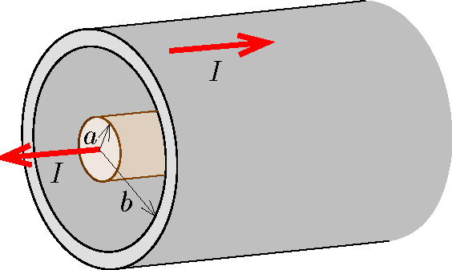

Imagine that power $P$ is delivered through the coaxial cable of length $\ell$ as shown in the figure. The radius of the inner conductor of the cable, which has negligible resistance, is $a$, and the radius of the thin-walled outer tube, which can be considered to have similarly negligible resistance, is $b$. There is a vacuum both outside the cable and between the inner conductor and the outer tube, and a direct current flows through the cable.

 $a)$ What is the value of the current if there is no outward and inward force exerted on the outer tube?
 $b)$ At which end of the coaxial cable – left or right – is the generator (voltage supply) and at which end is the resistor (load)?
 (6 pont)

