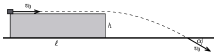

From one edge of a horizontal table, a point-like body is launched with an initial speed of $v_0$. The body slides along the surface of the table, then flies off the table and hits the ground at the speed of $v_0$, the angle between this final velocity and the horizontal is $\alpha=30^\circ$. The table is $h=0.8~\mathrm{m}$ high and $\ell=3.2~\mathrm{m}$ long (see the figure ).
 $a)$ What was the initial speed of the object?
 $b)$ What is the coefficient of kinetic friction between the table and the body?

 (4 pont)

