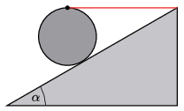

A uniform-density cylinder was placed on a slope with an angle of inclination of $30^\circ$, and tied to the slope at its highest point above the centre of its mass with a horizontal thread as shown in the figure . What should be the least value of the coefficient of friction between the cylinder and the slope in order that the cylinder remain at rest in this position?

 (4 pont)

