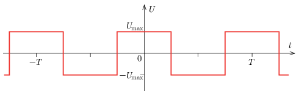
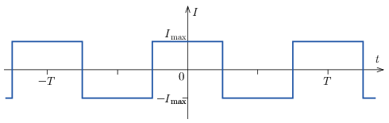

Suppose that we have measuring instruments that measure not only the RMS value of sinusoidal AC current or AC voltage, but also that of any periodic signal.
 $a)$ Connect an ideal inductor with self-inductance $L$ to a voltage generator with frequency $f=1/T$, which provides a symmetrical square-wave signal. Using ideal voltmeter and ammeter, measure the RMS value of the current through the inductor and the RMS value of the voltage across the voltage generator. The first figure shows the square waveform, and we know that at time $t=0$ the current through the inductor is zero.

 $b)$ Connect an ideal capacitor with capacitance $C$ to a voltage generator with frequency $f=1/T$, which provides a symmetrical square-wave signal. Using ideal voltmeter and ammeter, measure the RMS value of the current through the capacitor and the RMS value of the voltage across the voltage generator. The second figure shows the square waveform, and we know that at time $t=0$ the voltage across the capacitor is zero.

 What are the readings of the meters for the connection in part $a)$ and in part $b)$? Give the answers in terms of $I_\mathrm{max}$, $U_\mathrm{max}$, $L$, $C$ and $f$.
 (5 pont)

