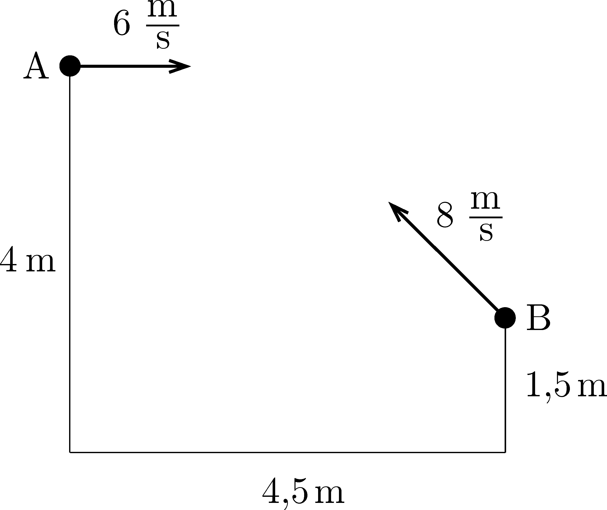

Two siblings, Anne and Brian are ``fighting'' with sock balls in the stairwell of their house, from a distance of $4.5~\mathrm{m}$ (measured horizontally) as shown in the figure . Anne throws the sock ball from the landing at a height of $4~\mathrm{m}$ with an initial horizontal velocity of $6~\mathrm{m}/\mathrm{s}$ and Brian throws the sock ball from a height of $1.5~\mathrm{m}$ with an initial velocity of $8~\mathrm{m}/\mathrm{s}$, making an angle of $45^\circ$ with the horizontal. Find the minimum distance between the two sock balls if the children threw them at the same time. (Neglect air resistance.)

 (4 pont)

