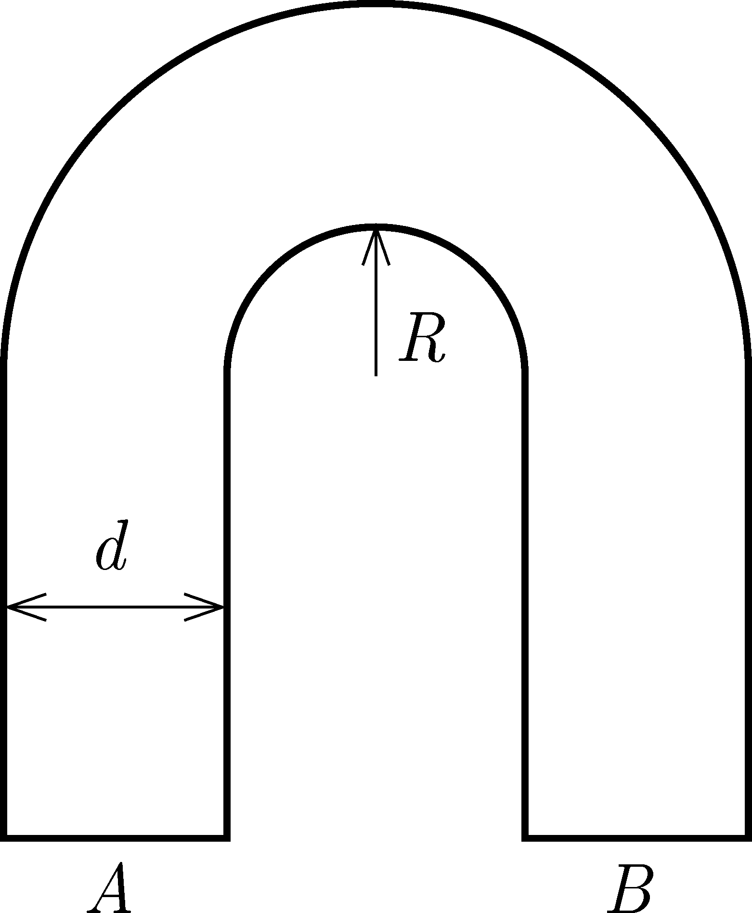

A glass rod, which has a square cross section, is bent to the shape shown in the figure. A parallel beam of light is incident perpendicular to surface $A$. What is the least ratio of $R/d$, if all the light incident on surface $A$ leaves the glass rod through surface $B$? The refractive index of the glass is ${n=1.5}$.

 (4 pont)

