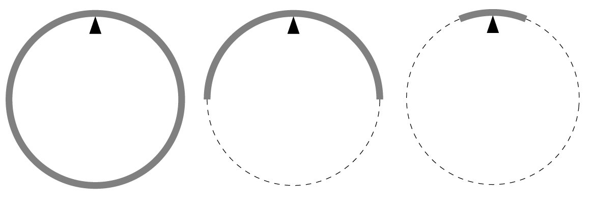

We make three different compound pendulums (physical pendulums).
 $a)$ A thin rod with uniform mass distribution is bent into a circle of radius $R$, and is supported by a wedge at a point on the inner rim of the circle, see the figure . The circular rod is free to rotate about the wedge in its plane.
 $b)$ A semicircle is cut from a similarly bent rod forming a circle of the same radius. This semicircular rod is supported at the midpoint of its circumference.
 $c)$ The same procedure is followed as in the previous case, but only a relatively short arc, an octant of the circular arc is placed at its midpoint to the wedge.
 All three pendulums are slightly displaced and the periods of their swings are measured. Which of these periods will be the greatest and which will be the smallest?

 (5 pont)

