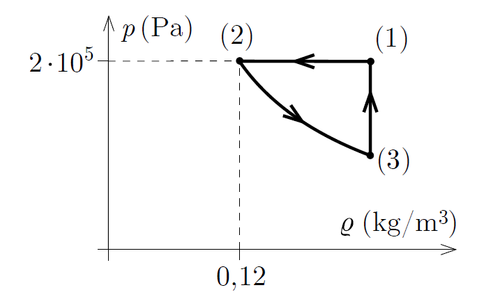

A heat engine is operated with a sample of helium, which has a constant amount. The pressure-density graph of the different parts of the cyclical process is shown in the figure. The temperature of the gas in its initial state (1) is 400 K, and during the process between states (2) and (3) the product of the pressure and the density of the gas is constant.
 $a)$ What is the temperature of the gas at state (2) and at state (3)?
 $b)$ What is the efficiency of this heat engine?

 (5 pont)

