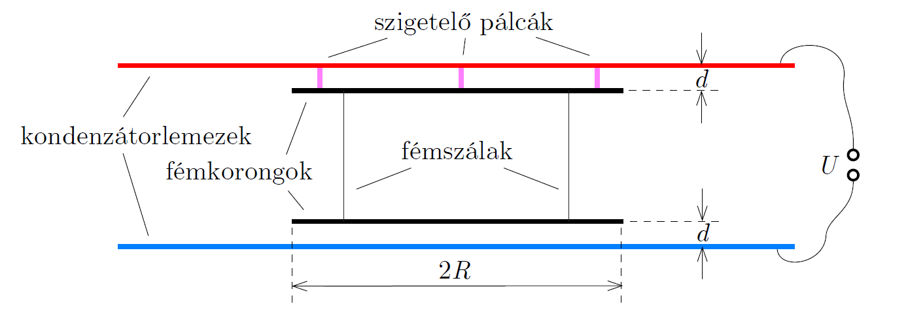

There are two neutral metal disks of radius $R$ between the plates of a parallel plate capacitor having a large area. The disks are parallel to the plates of the capacitor, and they are connected with several thin, unstretched metal threads. The disk at the top is fixed to the top plate of the capacitor with thin insulating rods. Each disk is at a distance of $d\ll R$ from the capacitor plate which is closer to it. (See the figure .)

 How much does the total tension in the metal threads change when a voltage of $U$ is applied to the capacitor?
 Data: $R=10~\mathrm{cm}$, $d=0.5~\mathrm{cm}$, $U=5000~\mathrm{V}$.
 (5 pont)

