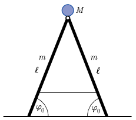

A twin ladder is standing on a frictionless, horizontal ground such that initially the angle between the ground and each side rail is $\varphi_0$. The spreaders between the front and rear rails prevents them from sliding apart. A man of mass $M$ sits on top of the ladder. The spreaders break and the ladder opens. At what speed and acceleration does the man reach the ground? What is the ratio of these two quantities to the speed and acceleration, respectively, when the man falls freely from the same height? Investigate the two limiting cases when $M\to 0$ and when $M\to\infty$. Consider the two sides of the ladder as uniform rods of mass $m$ and length $\ell$, and the man as a point. The two sides of the ladder are held together at the top by a frictionless hinge. (See the figure ).

 (5 pont)

