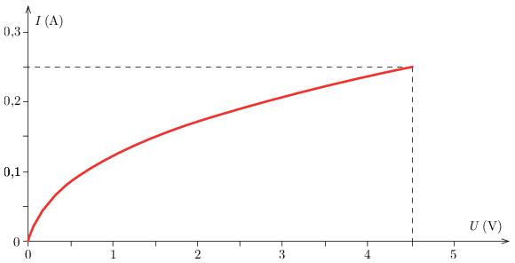

The electromotive force (emf) of a flat-pack lantern battery is $U_0=4.5~\mathrm{V}$, its internal resistance is $R_\mathrm{i}=1.5~\Omega$. We have two alike incandescent bulbs, whose $I(U)$ characteristics is shown in the figure .

 a) How does the terminal voltage of the battery depend on the current? Graph the $I(U)$ characteristics of the battery.
 b) A bulb is connected to the battery. Using the $I(U)$ graph determine the voltage across the bulb and the current flowing through the bulb (the so-called operating point).
 c) The two bulbs are connected
      i) in parallel
      ii) in series
 and then they are connected to the battery. Plot the $I(U)$ characteristics of the two bulbs (together) when they are connected in series and in parallel, and then determine the new operating point in both cases. Then determine in both cases the voltage across one bulb, and the current flowing through one bulb.
 (5 pont)

