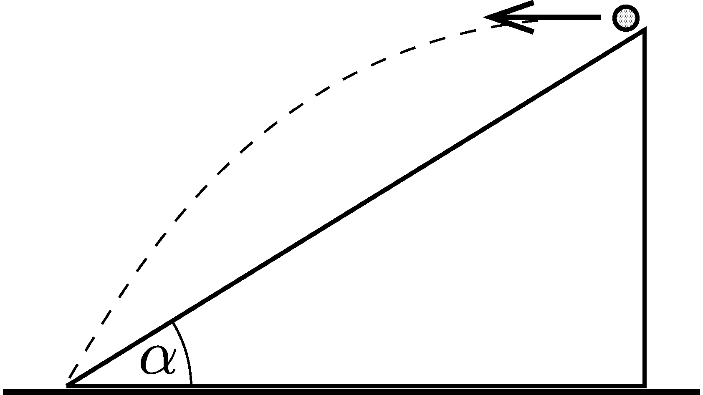

A small body is projected horizontally from the top of a fixed slope, and hits the bottom of the slope (see the figure ). On impact, its velocity makes an angle of $\beta=19^\circ$ with the plane of the slope. What is the angle of inclination of the slope?

 (3 pont)

