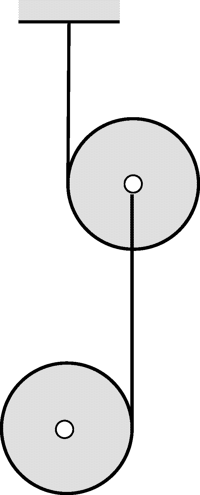

The ``double yo-yo'' shown in the figure consists of two identical discs with uniform mass distribution and the yarns wound on them.

 The two discs are released with zero initial velocity such that the yarns are vertical.
 a) Which of the two discs' axis will have a greater speed after a certain time elapsed, and how many times this speed is greater than the speed of the axis of the other disc?
 b) Which disc's angular speed will be greater after a certain time elapsed, and by what factor will this angular speed be greater than that of the other disc?
 (At the moment in question, the yarns have not yet been unwound from the discs.)
 (5 pont)

