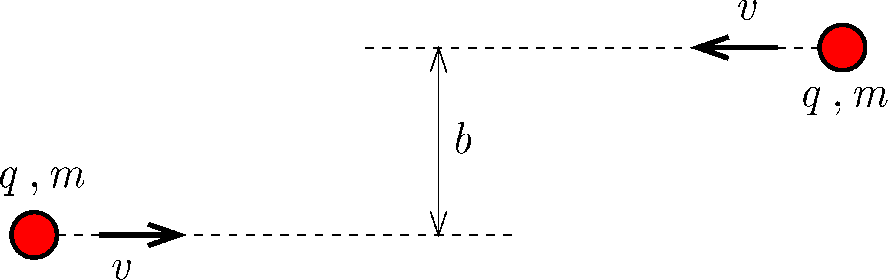

Two small insulating disks of mass $m$ and of charge $q$ are placed far apart on a horizontal, frictionless, insulating table top. They move initially in opposite directions, travelling at a speed of $v$. If they had no charge, they would move along the lines at a distance of $b$, as shown in the figure . What will the minimum velocity of the two discs be during their motion?

 (5 pont)

