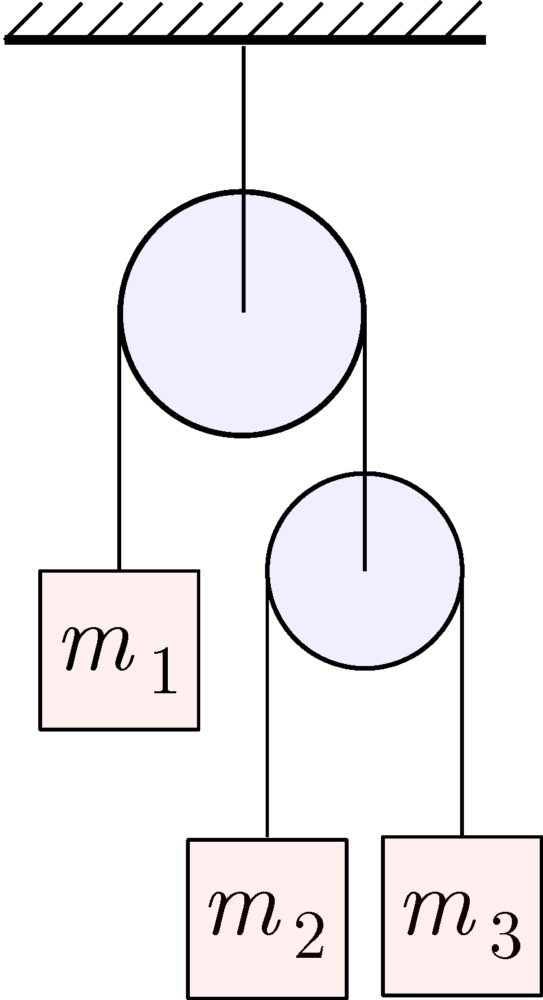

With what single mass $m$ should the pulley with the two masses on the right in the figure be replaced so that the body with mass $m_1$ moves in the same way as it did originally? Neglect the mass of the pulleys and friction.

 (4 pont)

