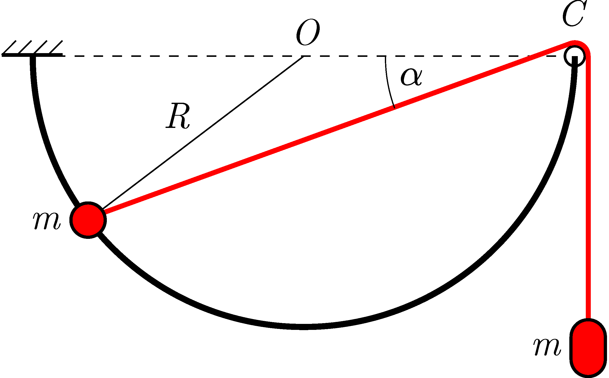

A point-like ball of mass $m$ is threaded to a fixed rigid semicircle-shaped wire, and can move along it frictionlessly. The diameter of the semicircle is horizontal, its radius is $R$, and the plane of the semicircle is vertical. (See the figure .) A thin thread is attached to the ball and wound through a small pulley at the end of the wire at $C$. A body of mass $m$ is attached to the other end of the thread. The ball on the left is released without a jerk from the horizontal position of the thread when the thread makes an angle of $\alpha=0^\circ$ with the horizontal diameter.

 a) What is the speed at which the bodies move when the ball on the left passes the lowest point of the wire?
 b) What is the acceleration of the bodies at this moment?
 (6 pont)

