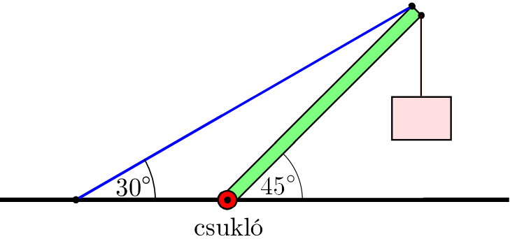

The system shown in the figure is in equilibrium. A load of 225 kg is hung on the end of a 45 kg supporting rod. Determine the magnitude and direction of the tension in the cable and of the force exerted by the hinge on the supporting rod.

 (4 pont)

