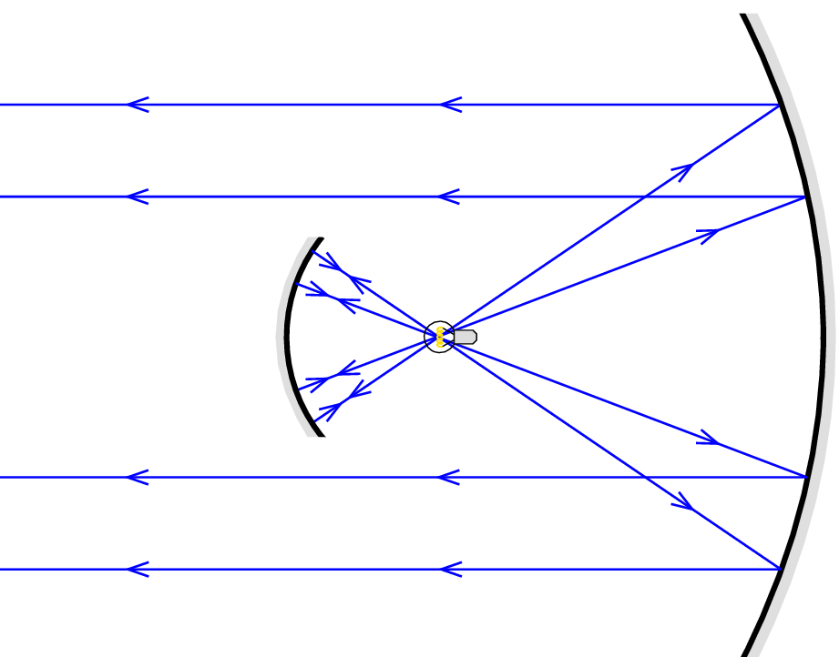

The figure shows an incandescent lamp between two concave mirrors. The mirror on the right produces a parallel beam of light, while the small mirror on the left prevents a significant part of the light from the bulb to escape from this mirror arrangement, which is similar to a car's reflector.
 a) Explain why this reflector produces a stronger light with the small mirror on the left than without it.
 b) Use a ruler to make measurements in the figure and find the ratio of the focal lengths of the two mirrors.
 c) Based on your measurements with the ruler, estimate what percentage of the light from the incandescent lamp is reflected in the parallel beam produced by the reflector without the small mirror, or with the small mirror.

 (5 pont)

