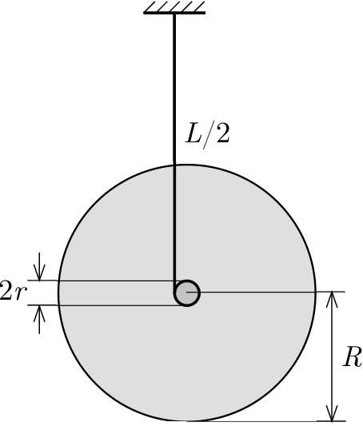

One end of a thin thread of length $L=20~\mathrm{cm}$ is attached to an axle of radius $r=0.5~\mathrm{cm}$, and $L/2$ length of the thread is wound on the axle. The axle is attached to a disc of radius $R=5~\mathrm{cm}$, of mass $m=0.5~\mathrm{kg}$ and of uniform mass distribution (see the figure ). Keeping the other end of the vertical thread in a fixed position, the disc is released.
 a) What is the tension in the thread during the motion of the uniformly accelerating disc (``yoyo'')?
 b) What is the speed of the axle of the disc at the moment the thread gets unwound?
 c) When the vertical movement of the disc is reversed, the tension in the thread increases for a short time (the disc ``jerks'' the thread). Estimate the average value of the tension in the thread during the jerk. The mass of the axle, the deviation of the thread from the vertical and air resistance can be neglected. Assume that the angular speed of the disc during the ``turn'' is constant.

 (6 pont)

