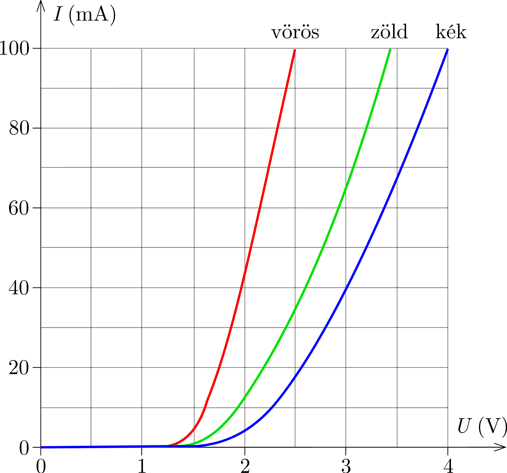

The figure shows the current-voltage characteristics of different colour LEDs. For a given value of voltage the current of the LED can be read from the graph.

 a) Using the graph , determine the power consumption of a red, a green and a blue LED when they are connected in parallel to a voltage supply of voltage $2.5~\mathrm{V}$.
 b) What is the power of the same three LEDs when they are connected in series to a voltage supply of voltage $7.5~\mathrm{V}$?
 (4 pont)

