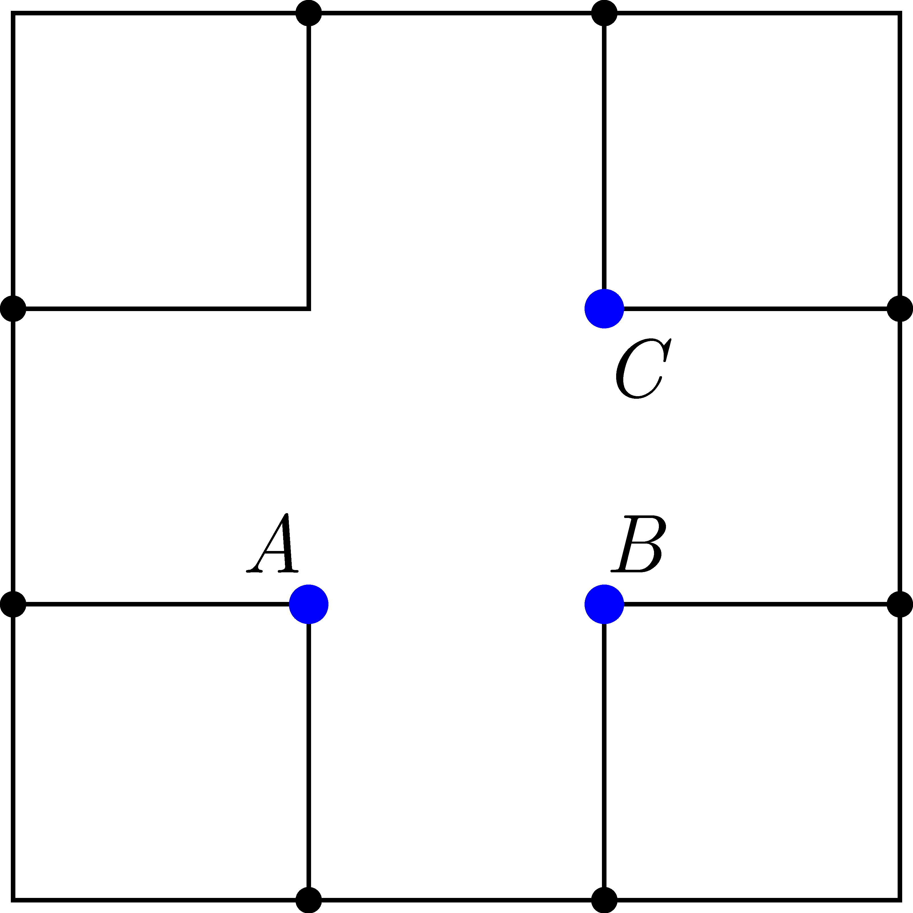

The frame shown in the figure is made from a piece of wire, which has uniform thickness. Calculate the ratio of the equivalent resistances between points $A$ and $B$ and between points $A$ and $C$.

 (5 pont)

