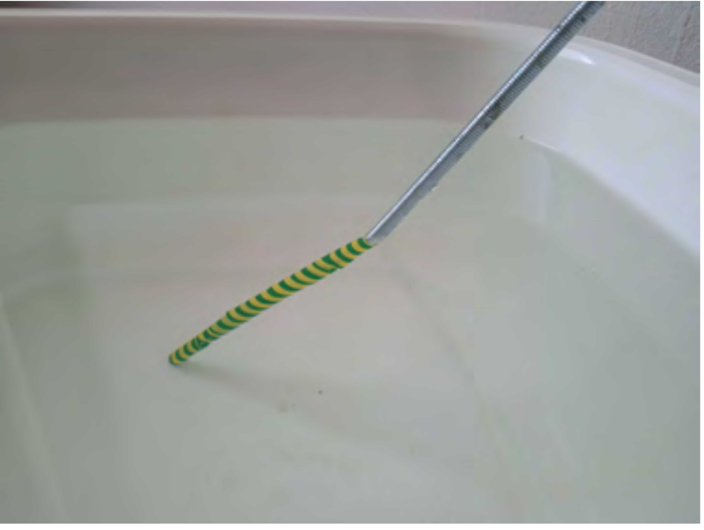
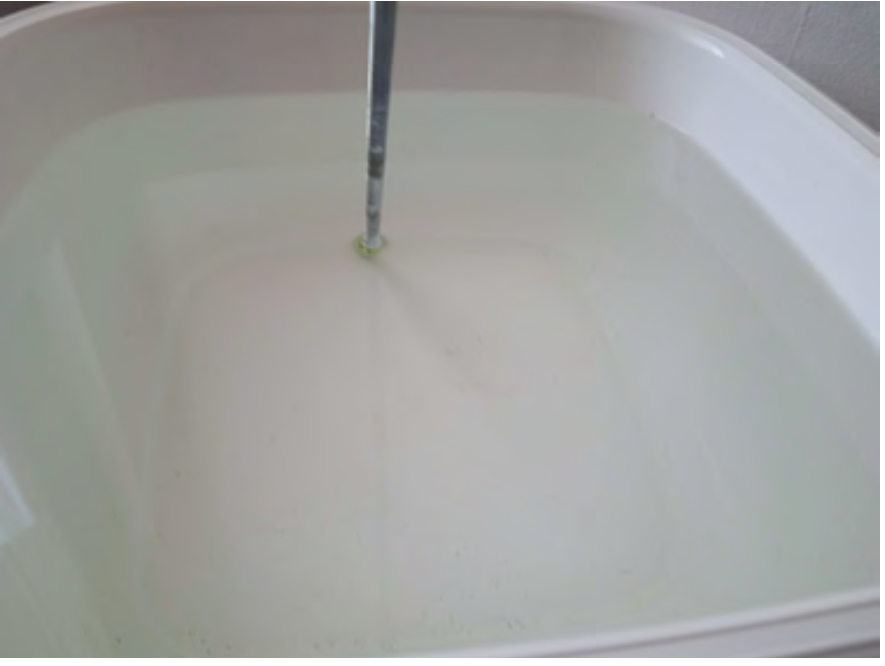

It is a well-known phenomenon that a breakpoint appears in the image of a thin, straight stick when it is partly immersed into a bowl of water (see Figure 1 ).

 Figure 1
 In Figure 2 there is a photograph of a stick that makes an angle $\varphi$ with the vertical. When the stick is photographed (or viewed) from a suitable direction, the submerged part of the stick is not visible at all, although the stick still reaches the bottom of the bowl. At what angle $\varphi$ can this phenomenon occur?

 Figure 2
 (4 pont)

