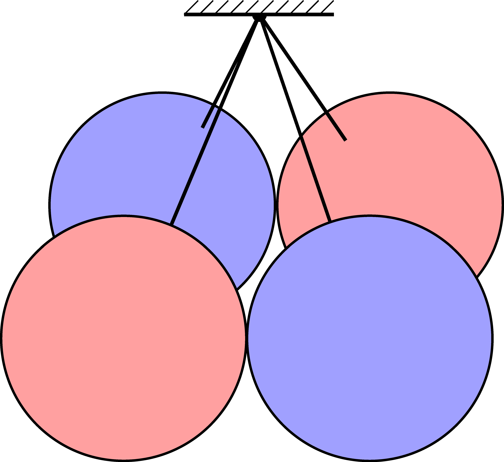

Four balls of radius $r$ and mass $m$ are held by thin threads of length $r$. One end of each thread is fixed at a common point so that the centers of the balls form a square. The two balls at the end of one diagonal of the square are red, the other two are blue. (Most of the mass of each ball is at the centre of the ball, so the moment of inertia of the balls is negligibly small. The frictional force between the balls is also negligible.)

 In this arrangement the balls are in an unstable equilibrium, from which the system will move away at the slightest external disturbance and will move towards a state of lower potential energy with increasing acceleration.
 a) What is the angle between the threads and the vertical in the initial and in lowest potential energy states?
 b) What is the maximum value of the total kinetic energy of the four balls?
 (6 pont)

