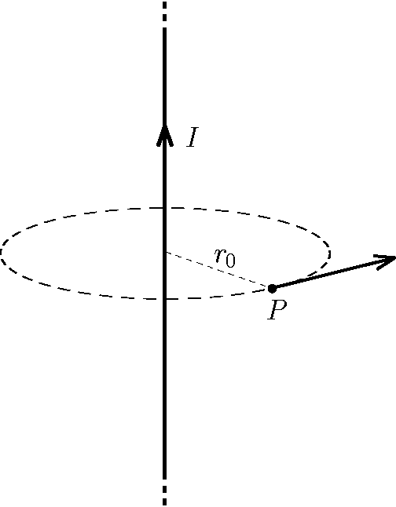

A constant current flows through a long, straight conductor positioned vertically in vacuum. From point $P$, located at a distance $r_0$ from the conductor, we launch a proton onto the straight conductor in a direction perpendicular to the plane containing point $P$, as shown in the figure. During its motion, the maximum distance of the proton from the conductor is $4r_0$.

 a) During the motion, what is the maximum angle $\vartheta$ between the direction of motion of the proton and the horizontal?
 b) What is the angle $\vartheta$ at the moment when the proton is at a distance $2r_0$ from the straight conductor?
 (6 pont)

