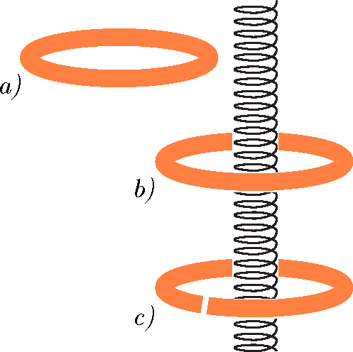

A copper pipe is bent into a circle and its ends are soldered together, that is, a hollow torus with copper walls is created. What is the electric field strength inside the copper tube and in the material of its wall, if the current in a sufficiently long , straight coil is changed at a constant rate in time and the copper tube is positioned as shown in the figure ,
 a)  next to the coil,

 b)  coaxially with the coil?
 c)  What is the electric field strength in the wall of the copper tube in the previous situation if the tube is cut somewhere?
 Supplying power to the coil was set up in a way that the magnetic effects of both the connecting cables and the resulting current occurring along the symmetry axis of the solenoid were eliminated. (E.g. power is supplied by a coaxial cable, and the solenoid is double-wound.)
 ÁBRA
 (5 pont)

