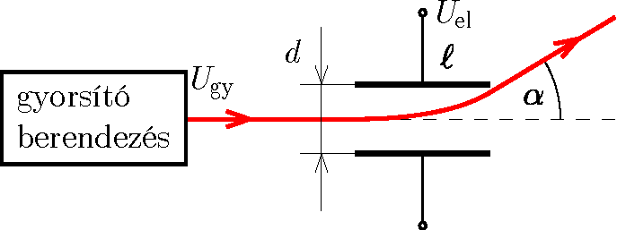

Using a device, charged particles are accelerated from rest, through a voltage of $U_\mathrm{gy}$, to a speed significantly less than the speed of light. The particles moving in a straight line in vacuum enter to a parallel plate capacitor, where they are deflected and exit the capacitor at some angle relative to the original direction of their motion. The length of the parallel plate capacitor is $\ell$, the distance between the plates is $d$, and the deflection voltage is $U_\mathrm{el}$. The charged particles enter the deflecting field along the symmetry line of the parallel plate capacitor, as shown in the figure, and do not collide with the plates during their motion. (The effect of gravity can be ignored.)

 a)  How does the angle of deflection $\alpha$ depend on the given data?
 b)  How does the type of particle used in the experiment affect the angle of deflection?
 (4 pont)

