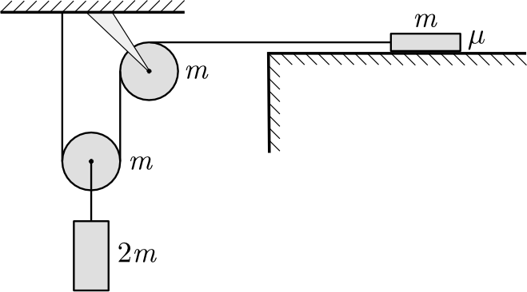

The coefficient of friction between the horizontal table shown in the figure and the body of mass $m$ on it is $\mu=0.5$. The pulleys, which can be considered uniform density discs, can rotate without friction, and the ropes do not slip on the rims of the pulleys. What is the magnitude and direction of the force exerted on the ceiling by the fixed pulley attached to it?

 (5 pont)

