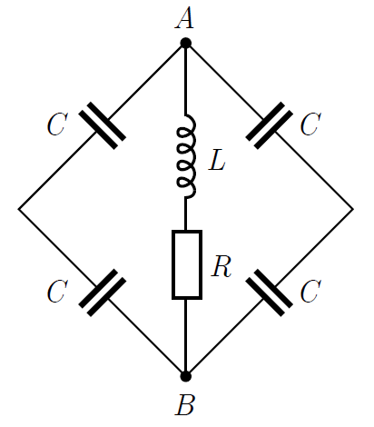

The figure shows a circuit which consists of a resistor of resistance $R=100~\Omega$, a coil of inductance $L=1~\mathrm{H}$, and four identical capacitors of capacitance $C=20~\mu\mathrm{F}$. An AC generator with frequency of $f=50~\mathrm{Hz}$ and r.m.s. (root-mean-square) voltage of $U_{\mathrm{eff}}=220~\mathrm{V}$ is connected to points $A$ and $B$.

 a) What is the active power of the circuit?
 b) How should the capacitance value $C$ be modified to get zero reactive power?
 (5 pont)

