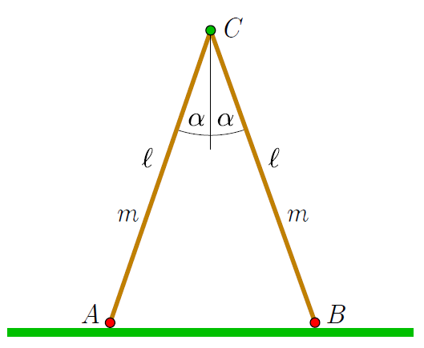

The figure shows a two-legged ladder-like structure. The thin, uniform density rods placed in a vertical plane are joined with a light frictionless hinge. The length of the rods is $\ell$, they each has mass of $m$, and on their lower ends there are light castors that ensure that the rods can move frictionlessly apart on the horizontal surface. Initially, the angle of the two rods is $2\alpha$. From this position, the rods start to move without any push. While sliding apart, the rods remain in the initial vertical plane.

 a) At what speed does the hinge $C$ strike the horizontal plane?
 b) What is the acceleration of the points $A$, $B$ and $C$ right after the starting moment?
 c)
 (6 pont)

