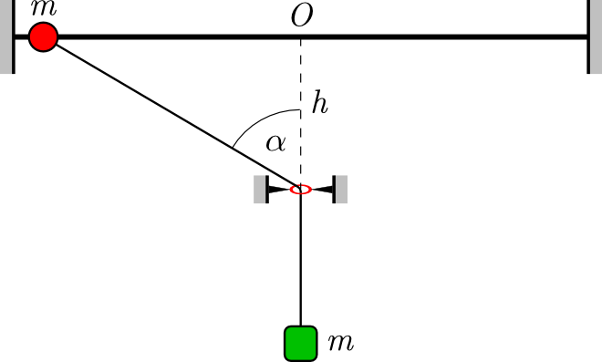

A point-like ball of mass $m$ can move without friction along a long horizontal rod. A string attached to the ball passes through a small ring situated at a depth $h$ below the rod, and a weight of mass also $m$ is attached to its free end. When the inclined segment of the string makes an angle $\alpha=60^\circ$ with the vertical, the ball is released from rest.

 a)  By what factor is the tension in the string greater as the ball passes above the ring than at the instant immediately after release?
 b)  What is the period of small oscillations of the ball about its equilibrium position?
 (5 pont)

