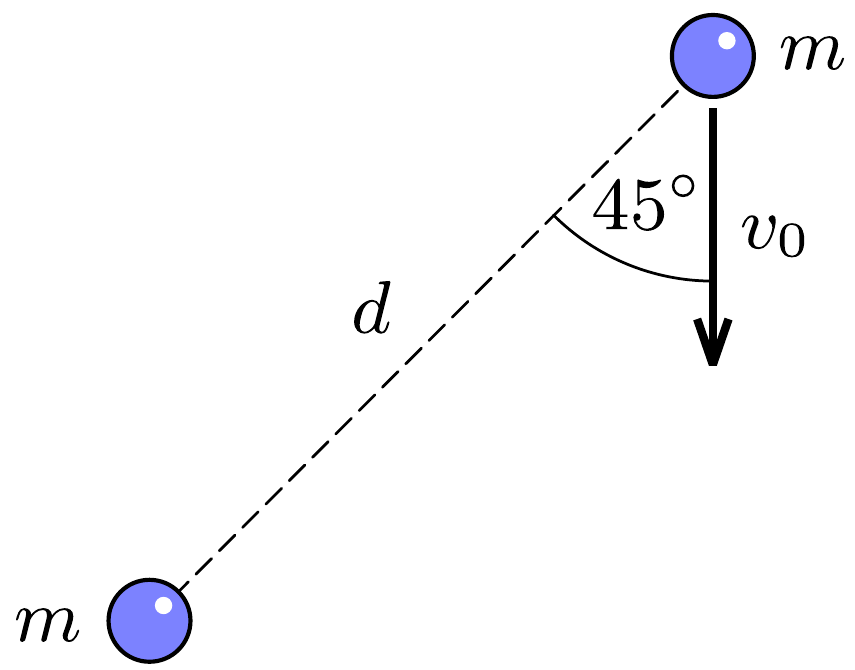

## F1

Az ábrán látható két pontszerú, szabad elmozdulásra képes test között csak a tömegvonzás hat. Kezdetben a testek távolsága $d$, az egyik $m$ tömegü test nyugalomban van, a másik (ugyancsak $m$ tömegú) test pedig $v_{0}=k \sqrt{\gamma m / d}$ sebességgel mozog az ábrán látható irányban, ahol $k$ paraméter, $\gamma$ pedig a gravitációs állandó.

a) Legalább mekkora $k$ értéke, ha a testek hosszú idő után egymástól nagyon messzire („végtelen” távolra) kerülnek?
b) Mekkora a testek közötti legnagyobb távolság $k=1$ esetén?
