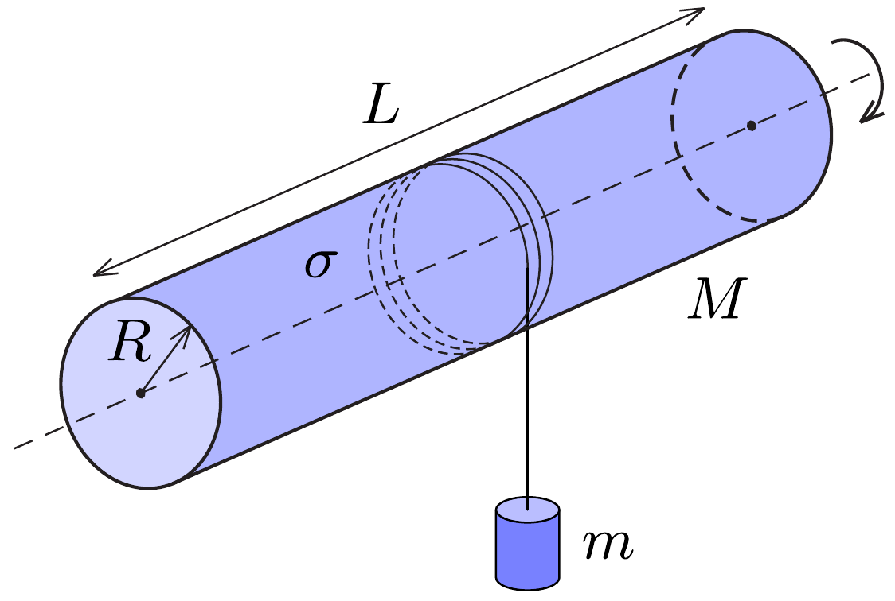

## F2

Egy szigeteló anyagból készült $R$ sugarú, $L$ hosszúságú $(L \gg R)$, vékony falú, $M$ tömegú cső egyenletesen fel van töltve $\sigma$ felületi töltéssürúséggel. A cső rögzített szimmetriatengelye körül súrlódásmentesen foroghat. A csőre fonalat csévélünk, melynek végére $m$ tömegü kis testet rögzítünk. Mekkora gyorsulással mozog a kis test, ha elengedjük?

