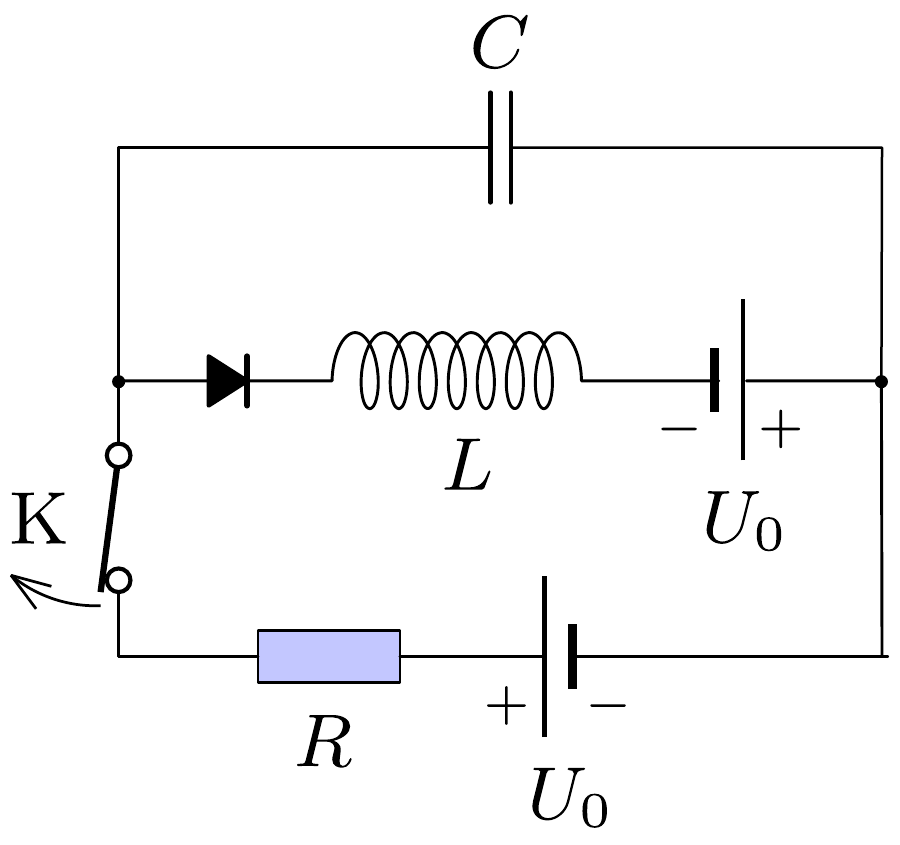

## F3

Az ábrán látható áramkörben a telepek, a dióda és a tekercs ideális. A K kapcsoló hosszú ideje zárva van. Adatok: $L=150 \mathrm{mH}, C=200 \mathrm{nF}, R=500 \Omega$, $U_{0}=9,0 \mathrm{~V}$.

a) Mekkora maximális $U_{\text {max }}$ feszültségre töltődik fel a kondenzátor, miután a kapcsolót kinyitjuk?
b) A kapcsoló kinyitása után mennyi idővel éri el a kondenzátor feszültsége az $U_{\text {max }}$ értéket?
