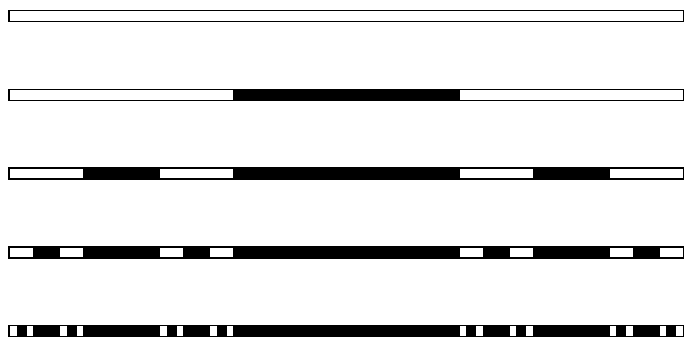

## V3

Diffrakciós fraktálrácsot a következőképp készíthetünk. Egy nagy kiterjedésú, átlátszatlan lap $d$ szélességú sávját átlátszóvá tesszük $(m=0)$, így egy egyszerú rést kapunk. Ezután ezt a rést felosztjuk három azonos szélességú sávra, majd átlátszatlanná tesszük a középső sávot $(m=1)$. Következő lépésben a maradék átlátszó sávokat is három egyforma szélességű részre osztjuk, melyek közül a középsőt átlátszatlanná tesszük $(m=2)$. Ezt a múveletet ismételve juthatunk el az egyre magasabb fokú $(m=3,4, \ldots)$ rácsokhoz, ahogy az ábrán is látható.

\[
\begin{aligned}
& m=0 \\
& m=1 \\
& m=2 \\
& m=3 \\
& m=4
\end{aligned}
\]

Az így elkészített, különböző fokú fraktálrácsokat merólegesen $\lambda$ hullámhosszú lézerfénnyel világítjuk meg $(\lambda \ll d)$, és azt vizsgáljuk, hogy milyen diffrakciós intenzitáseloszlás jön létre az elhajlási szög szinuszának, azaz az $s=\sin \alpha$ változónak a függvényében.
a) Ábrázoljuk az $m=1$ fokú rács diffrakciós képének intenzitáseloszlását! Ügyeljünk a fontosabb részletek feltüntetésére.
b) Ábrázoljuk az $m=2$ fokú rács intenzitáseloszlását is!
c) Milyen rekurziós szabály alapján származtathatjuk a magasabb fokú rácsok intenzitáseloszlását? Más szóval fejezzük ki az $I_{m+1}(s)$ intenzitáseloszlást az $I_{m}(s)$ eloszlás segítségével!
