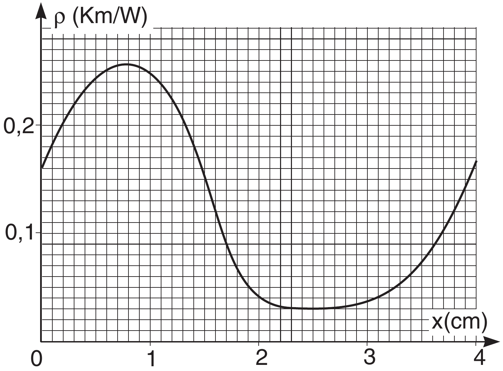

**2. HEAT FLUX (4 points)**

Heat resistivity is equal to the ratio of the temperature difference between the end-points of a wire of unit cross-section and unit length, and the heat flux (unit: W) through this wire.

1) Microprocessor of power $P=90 \mathrm{~W}$ has a water-cooling system. The chip and flowing water are separated by a copper plate of thickness $d=5 \mathrm{~mm}$ and cross-section area $s=100 \mathrm{~mm}^{2}$. What is the temperature difference between the processor and water? The copper heat resistivity is $\rho=2,6 \mathrm{~mm} \cdot \mathrm{K} / \mathrm{W}$.

2) A wire is made of different alloys, its heat resistivity $\rho$ as a function of the coordinate along the wire is given in the attached graph. The cross-section area of the wire is $S=1 \mathrm{~mm}^{2}$, its length $l=4 \mathrm{~cm}$. Find the heat flux through the wire, if one end of the wire is kept at the temperature 100°C, and the other end at 0°C.

