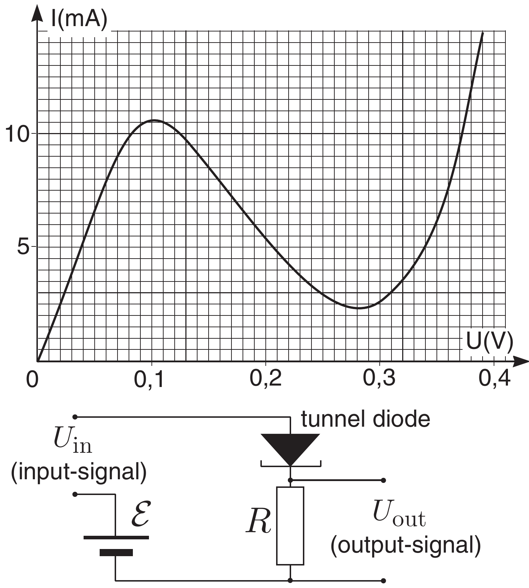
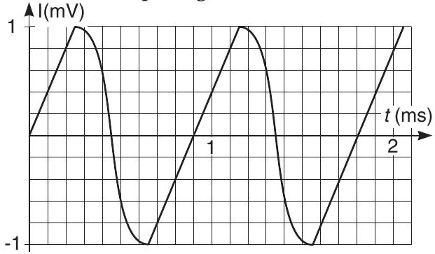

**4. TUNNEL DIODE (8 points)**

Tunnel diode is a semiconductor device, similar to the ordinary diode, the voltage–current characteristic of which is given in the attached graph. The circuit below describes a simple amplifier. The resistance $R=10 \Omega$, battery voltage $\mathcal{E}=0,25 \mathrm{~V}$.

1) Find the current in the circuit, if $U_{\text {in }}+\mathcal{E}=$ 0,08 V.

2) Find the output voltage $U_{\text {out } 0}$ if $U_{\text {in }}=0 \mathrm{~V}$.

3) Find the output signal $U_{\text {out }}-U_{\text {out } 0}$ if $U_{\text {in }}=$ 1 mV.

4) The input signal is given in the graph below. Sketch the output signal as a function of time.

