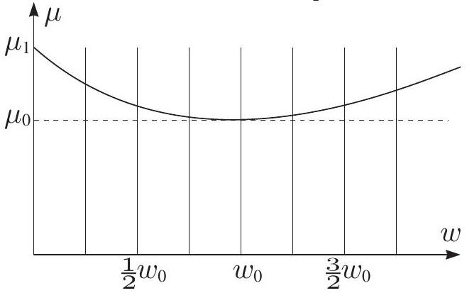

**5. VIBRATION (10 points)**

Consider a smooth horizontal surface, which is moved periodically back and forth along the horizontal $x$-axis: during the first semi-period $\tau$, the surface velocity is $u$, during the second semi-period $-u$. A brick of mass $m$ is put on that surface; the friction coefficient between the surface and brick is $\mu$, free falling acceleration is $g$.

1) The brick has initial $x$-directional velocity $v$. Which condition between the quantities $g, \mu, v$, and $\tau$ has to be satisfied in order to ensure that the brick velocity change during a semi-period is negligible? Further we assume that this condition is satisfied.

2) The brick is kept in motion along $x$-axis by a force $F_{x}$ in such a way that the mean brick velocity is $v$. Sketch graphically the dependence $F_{x}(v)$.

3) The brick is kept in motion along (horizontal) $y$-axis by a force $F_{y}$ in such a way that the mean brick velocity is $v$. Find the dependence $F_{y}(v)$.

4) Until now we have ignored the dependence of the friction coefficient on the sliding velocity. Further let us assume this dependence is given by the graph below. The brick is kept in motion along $x$-axis by a force $F_{x}$ in such a way that the mean brick velocity is $v$. Sketch graphically the dependence $F_{x}(v)$ taking $u=\frac{3}{4} w_{0}$.

5) The brick is put on the surface, there are no external forces. What is the brick's terminal velocity $v$? Provide the answer as a function of $u$.
