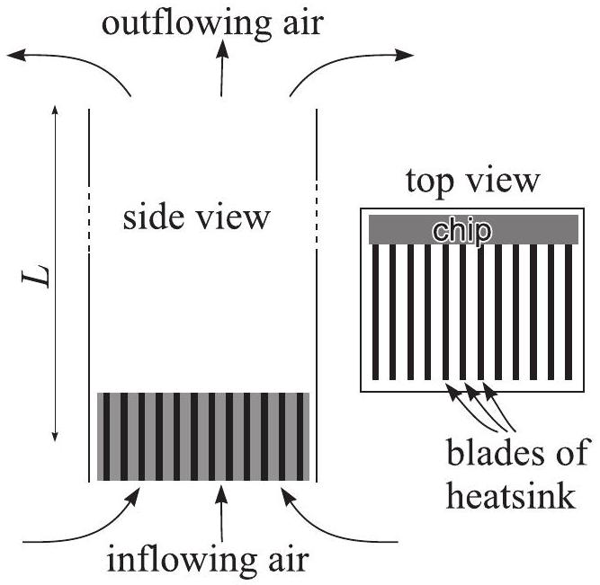

**7. PASSIVE AIR-COOLING (9 points)**

Consider the passive cooling system depicted in the figure. Cold air (at normal
conditions: $p_0=10^{5}\ \mathrm{Pa}$, $T_0=293\ \mathrm{K}$) flows over the heat
sink of a chip of power dissipation $P=100\ \mathrm{W}$, into a vertical pipe of
length $L=1\ \mathrm{m}$ and cross-sectional area $S=25\ \mathrm{cm}^{2}$. After
passing through the pipe, air enters the ambient room. Assume that the air inside
the pipe becomes well mixed; neglect the viscous and turbulent friction of air
inside the pipe and heat sink. Air can be considered as an ideal gas with adiabatic
exponent $\gamma=1.4$ and molar mass $\mu=29\ \mathrm{g/mol}$.

**1)** Express the heat capacity at constant pressure $c_p$ via the quantities
$\gamma$ and $R$ (1 point).

**2)** Find a relationship between the outflowing air density $\rho$ and temperature
$T$ (the relationship may contain also the parameters defined above) (2 points).

**3)** Find a relationship between the air-flow velocity in the pipe $v$ and
outflowing air density $\rho$ (the relationship may contain also the parameters
defined above) (2 points).

**4)** Express the power dissipation $P$ in terms of the air-flow velocity $v$, the
outflowing air temperature $T$, and density $\rho$ (the relationship may contain
also the parameters defined above) (2 points).

**5)** What is the temperature $T$ of the outflowing air? In your calculations, you
may use the approximation $T-T_0 \ll T_0$ (2 points).
