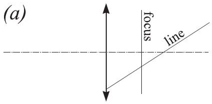
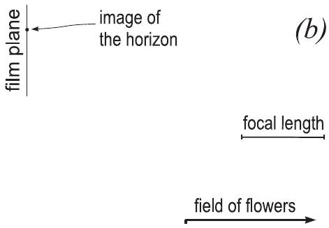

**3. TILT-SHIFT LENS (6 points)**

**1)** Show that an image of a straight line created by a thin lens is also a
straight line. Consider two-dimensional geometry only, i.e. assume that the main
optical axis and the straight line lie in the same $(x,y)$ plane. Hint: use the
coordinate system where the origin coincides with the centre of the lens and
represent lines algebraically, e.g. $y=ax+b$. Make use of the thin-lens formula
$f^{-1}=x^{-1}-x^{\prime -1}$ ($x>0$; $x$ and $x'$ are the $x$-coordinates of a
point and its image, respectively) (2 points).

**2)** In figure (a), draw the image of the given line and indicate which parts of
the image are virtual and which are real (2 points).

**3)** A photographer wants to take a photo of a field of flowers. In order to get
an image where all the flowers (both the close and far ones) are sharp, he has to
use a lens with tilt-shift (TS) capabilities (either an ordinary camera with a
TS lens, or a large-format camera where the entire lens compartment can be freely
positioned). The field of flowers (which extends effectively to infinity) and the
image of its distant edge, together with the image plane, are depicted in figure
(b). Reconstruct the position of the lens, the focal length of which is provided
as a scale (2 points).

