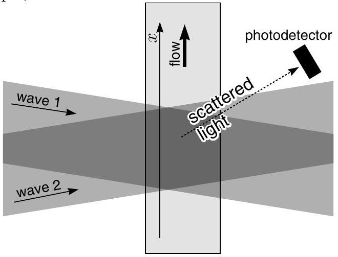

**V. ANEMOMETER (6 points)**

Anemometer is a device measuring flow rate of a gas or a fluid. Let us look at the construction of a simple laser-anemometer. A fluid with refractive index $n=1.3$, containing light-scattering particles, flows in a rectangular pipe with thin glass walls. Two coherent plane waves with wavelength $\lambda=515\ \mathrm{nm}$ and angle $\alpha=4^\circ$ between their wave vectors are incident on a plate so that (a) the angle bisector of the angle between the wave vectors is normal to one wall of the pipe and (b) the pipe is parallel to the plane defined by the wave vectors. Behind the pipe is a photodetector that measures the frequency of changes in scattered-light intensity.

1) What is the (spatial) period $\Delta$ of the interference pattern created along the $x$-axis (see Figure; 2 pts)?
2) Let the oscillation frequency of the photometer signal be $\nu=50\ \mathrm{kHz}$. How large is the fluid's speed $v$? What can be said about the direction of the fluid flow (2 pts)?
3) Let us consider a situation in which the wavelengths of the plane waves differ by $\delta\lambda=4.4\ \mathrm{fm}$ ($1\ \mathrm{fm}=10^{-15}\ \mathrm{m}$). What is the frequency of signal oscillations now, if the fluid's speed is the same as in the previous part? Is it possible to determine the flow direction with such a device (2 pts)?

