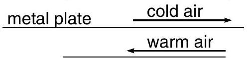
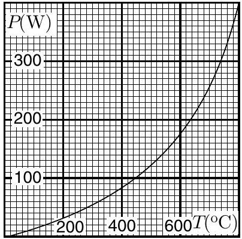

**VII. HEAT EXCHANGE (8 points)**

1) Consider a simplified model of the air ventilation system of a house using a passive heat exchanger. The exchanger consists of a metal plate of length $x$ and width $y$ and thickness $d$ dividing the air channel into two halves, one for incoming cold air, and another for outgoing warm air. Both channels have constant thickness $h$, air flow velocity is $v$ see Figure. Thermal conductance of the metal is $\sigma$ (the heat flux through a unit area of the plate per unit time, assuming that the temperature drops by one degree per unit thickness of the plate). Specific heat capacity of the air by constant pressure is $c_{p}$, air density is $\rho$ (neglect its temperature dependance). You may assume that the air is turbulently mixed in the channel, so that the incoming and outgoing air temperatures $T_{\text {in }}$ and $T_{\text {out }}$ depend only on the coordinate $x$ (the $x$-axes is taken parallel to the flow velocity), i.e. $T_{\text {in }} \equiv T_{\text {in }}(x)$ and $T_{\text {out }} \equiv T_{\text {out }}(x)$. Assuming that the inside and outside temperatures are $T_{0}$ and $T_{1}$, respectively, what is the temperature $T_{2}$ of the incoming air at the entrance to the room (4 pts)?

2) Attached is a plot of the heat exchange rate $P$ of the wire of an electric heater as a function of temperature (assuming the room temperature is $T_{0}=20^{\circ} \mathrm{C}$ ). The operating temperature of the wire is $T_{1}=800^{\circ} \mathrm{C}$. The heater is switched off; find the time after which the temperature of the wire will drop down to $T_{2}=100^{\circ} \mathrm{C}$. The heat capacitance of the wire is $C=10 \mathrm{~J} / \mathrm{K}$ (4 pts).

