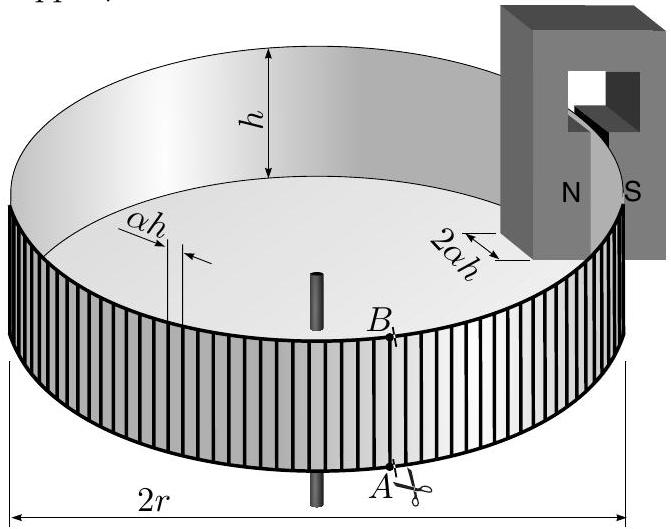

**II. MAGNETIC BREAK (12 points)**

Foucault currents can be used to decelerate moving metal objects, e.g. a rotating disc. Consider the following simple model. For the sake of simplicity, the disc is substituted by a "circular railway", see Figure. A plastic "can" of radius $r=15\ \mathrm{cm}$, mass $m=100\ \mathrm{g}$, and height $h=1\ \mathrm{cm}$ consists of a homogeneous disc (the bottom of the "can") and a much thinner cylindrical wall. Along the edges of the cylinder, there are two wire rings ("rails"), which are connected with a set of parallel wire bars ("sleepers"). Both the "sleepers" and "rails" are made of copper wire of diameter $\delta=0.2\ \mathrm{mm}$; the distance between the "sleepers" is $L=\alpha h$, where $\alpha=0.3$. Frictionless rotation of the system is decelerated by a homogeneous magnetic field $(B=1\ \mathrm{T})$ in the slit between the poles of a permanent magnet, see Figure. Assume that the homogeneous field fills a region of rectangular cross-section equal to the area between three subsequent "sleepers" (i.e. of size $h \times 2\alpha h$). Outside that region, the field is negligible. The specific resistance of copper is $\rho=1.724\cdot10^{-8}\ \Omega\mathrm{m}$.

Suppose the system is motionless.

1) Find the resistance $R$ of a single "sleeper" (1 pt).
2) Suppose the "rails" are cut near the end-points of a certain "sleeper" $A$ and $B$. Prove that the resistance between $A$ and $B$ is approximately given by $R_{0}=R[\sqrt{\alpha(\alpha+2)}-\alpha]$ (2 pts).

Now suppose the system is rotating with an angular speed $\omega=1 \mathrm{rad} / \mathrm{s}$, and the "rails" are uncut.
3) Sketch an equivalent DC circuit, so that the currents through the resistors are equal to the currents in the respective "railway" elements: "sleepers" and "rail" segments (between subsequent "sleepers"; 2 pts).
4) Using the above obtained results, prove that the (Joule) dissipation power is given by formula $P=k B^{2} \omega^{2} / R$, and express the constant $k$ (3 pts).
5) Find the decelerating torque $M$ (2 pts).
6) Prove that the angular speed will vanish as $\omega=\omega_{0} e^{-t / \tau}$, and determine the time constant $\tau$ (2 pts).
