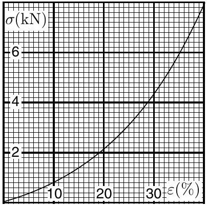
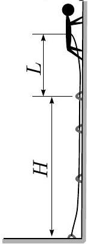

**I. ROCK CLIMBER (6 points)**

A rock climber of mass $m=80 \mathrm{~kg}$ ascends along a vertical rock. For self-protection, the climber uses the following method. One end of an elastic rope is anchored to the ground. The rope goes through smooth protection loops (carabiners), which are anchored to the rock. The height of the last carabiner is $H=20 \mathrm{~m}$. The other end of the rope goes through a special braking clip which is tied to the harness of the climber. During the climb, this clip keeps rope tight, but enables the climber to lengthen protective part of the rope. (Assume that the rope between the clip and carabiners is always tight) When falling, the maximum acceleration must not exceed $a_{\text {max }}=5 g$ (to protect from injuries). You may assume that the rope is always vertical, the distance between the clip and the centre of mass of the climber is very small, and friction between the rope and carabiners is negligible. Relationship between the strain and stress of the rope is sketched on the graph below.

1) Assume that the distance between the climber and the last carabiner is $L$ (see Figure). If the climber happens to fall, the distance between the highest carabiner and the climber will reach a maximal value $l$ (afterwards, the elasticity of the rope starts lifting the climber). Which inequality should be satisfied for $l$ ? (1.5 pts)
2) Find the maximal safe length $L$ between the climber and the last carabiner (upon reaching of which he has to anchor a next carabiner; 4.5 pts).

