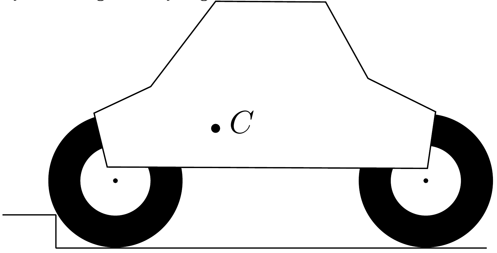

**6. CAR (7 points)**

A car attempts driving over a road barrier, starting from rest, as shown in the figure. The diameter of its wheel $d=1 \mathrm{~m}$, coefficient of friction between the wheels and ground $\mu=1$. The sketch is drawn using correct proportions, point $C$ marks the position of the car's centre of mass. Determine the maximal height of those road barriers which can be driven over with such a car, assuming that there is no drag in the non-driving axis (i.e. wheels rotate without friction), and the driving wheels are

**1)** front wheels;

**2)** rear axle.

**3)** Suppose that the car has four-wheel drive, and the road barrier is substituted with a wall. Would it be possible to raise the front of the car by driving slowly against the wall?

