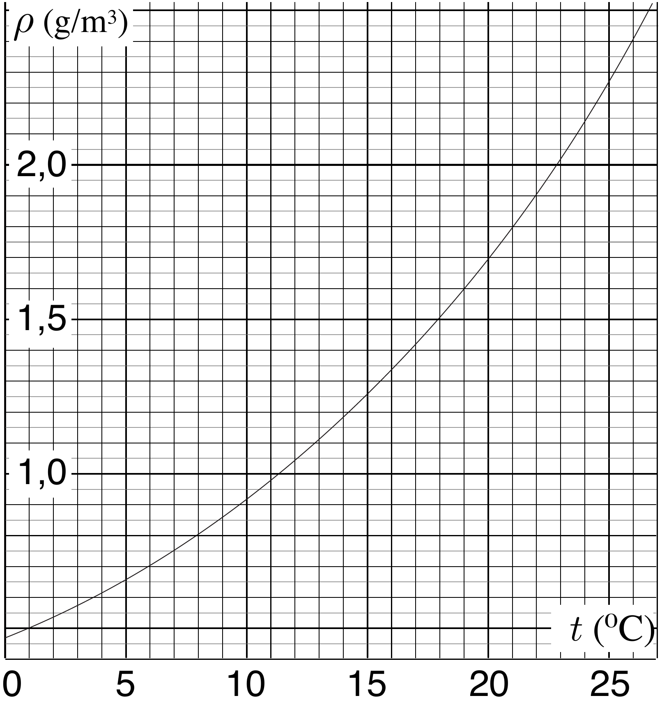

**1. DRYING (12 points)**

According to the widespread belief, it is useful to keep a window open when drying laundry even if the relative humidity outside is 100\%, because the temperature of the incoming air rises and thereby the relative humidity drops. Let us analyse whether these arguments hold when heating is switched off.

Suppose that inside a room, the volume of air $V_{1}=20 \mathrm{~m}^{3}$ from inside at the temperature $t_{1}=25 \mathrm{C}^{\circ}$ is mixed with the volume of air $V_{2}=10 \mathrm{~m}^{3}$ from outside at the temperature $t_{2}=1 \mathrm{C}^{\circ}$. The specific heat of the air (at constant pressure) $c_{p}=1005 \mathrm{~J} /(\mathrm{kg} \cdot \mathrm{K})$ can be assumed to be constant for the given temperature range; heat exchange with the surroundings can be neglected. For the time being, you may neglect the possibility of (partial) condensation of the vapour.

**1)** Prove that the total volume of the air will not change, i.e. that the volume of the mixed air is $V=V_{1}+V_{2}$.

**2)** What is the temperature of the mixed air $T$?

**3)** The graph below shows the dependence of the saturated vapour density for water as a function of temperature. Before mixing, both the interior and exterior air had relative humidity $r_{0}=100\%$. What is the relative humidity $r$ of the mixed air (if it happens to increase, then assume that an oversaturated vapour with $r>100\%$ is formed)?

**4)** If you happened to obtain $r>100\%$, then the oversaturated vapour breaks down into a fog which contains tiny water droplets. In that case, what is the mass $m$ of the condensed water (i.e. the total mass of the water droplets)? Air density $\rho_{0}=1.189 \mathrm{~kg}/\mathrm{m}^{3}$; latent heat of vaporization for water $q=2500 \mathrm{~kJ}/\mathrm{kg}$.

