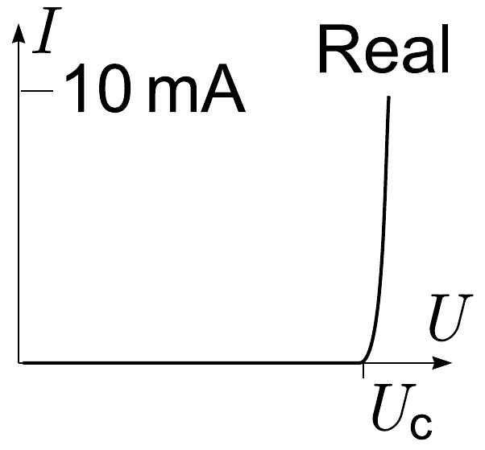
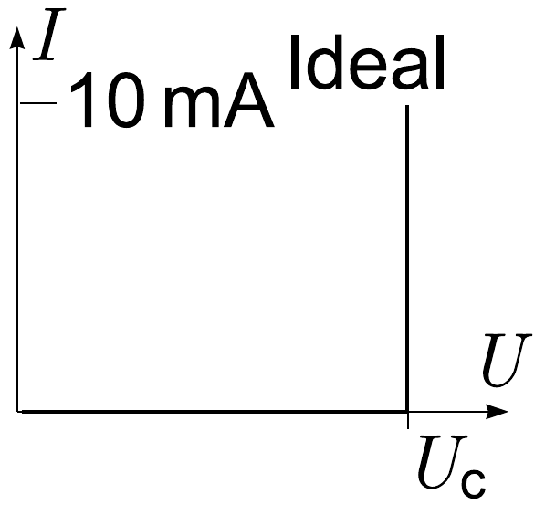

**4. ELECTRIC EXPERIMENT (12 points)**

Find the capacitance of an unknown capacitor and estimate the experimental uncertainty. Equipment: a red light-emitting diode (LED), three resistors—one with resistance $R_{1}=1.5 \mathrm{k\Omega}$, one with resistance $R_{2}=6.2 \mathrm{k\Omega}$, and one of unknown resistance; a battery of unknown electromotive force (internal resistance is smaller than $500 \Omega$), wires, timer, and an unknown capacitor.

**Remarks:** Below is provided a typical $V$-$I$ curve of an LED; during this experiment, the $V$-$I$ curve of the LED can be approximated with that of an ideal diode, cf. graph. The value of the opening voltage $U_{c}$ of the LED is not known. When there is a non-zero current through the LED, it emits light.

If a capacitor of capacitance $C$ and a resistor of resistance $R$ are connected in series to an electromotive force $E$, then the capacitor's voltage will approach its asymptotic value exponentially: $U=E \pm U_{0} e^{-t / R C}$.

