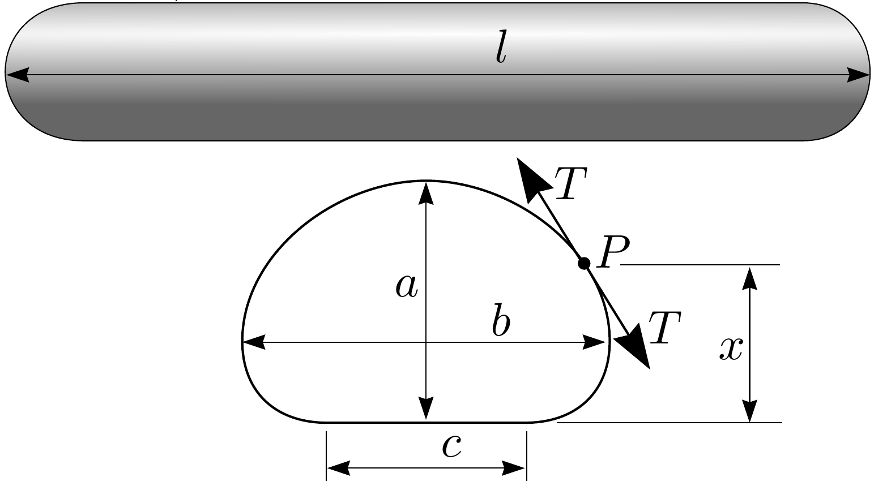

**5. EMPTY BAG (12 points)**

A cylindrical bag is made from a freely deformable fabric, impermeable to air, which has surface mass density $\sigma$; its perimeter $L$ is much less than its length $l$. If this bag is filled with air, it resembles a sausage. The bag is laid on a horizontal smooth floor (coefficient of friction $\mu=0$). The excess pressure inside the bag is $p$, the free-fall acceleration is $g$. The density of air is negligible.

**1)** Find the width of the contact surface between the bag and the floor $c$.

**2)** Prove that the tension in the bag's fabric $T=\alpha x+\beta$, where $x$ is the height of the given point $P$ above the floor, and find the coefficient $\alpha$. Remark: fabric's tension is (loosely speaking) the force per unit length. Actually, fabric's tension is not as simple a concept as a rope's tension, because different force directions are possible; here, however, we neglect the force component along the "sausage's" axis. Thus, we can describe the fabric's tension here with a single number, the force per unit length $T$ acting across a horizontal cut of the "sausage".

Hint: consider the force balance for a small piece of fabric (using the vertical cut shown in the figure).

**3)** Let the highest point of the bag be at height $a$ from the floor. What is the tension $T_{1}$ at this highest point? Express your answer in terms of $a$, $\sigma$ and $p$ (or $\alpha$, if you were unable to answer the previous question).

Hint: consider the force balance between two halves of the bag.

**4)** Assuming that $p \gg \sigma g$, determine the quantity $\varepsilon=\frac{b-a}{b+a}$, where $b$ is the width of the bag.

