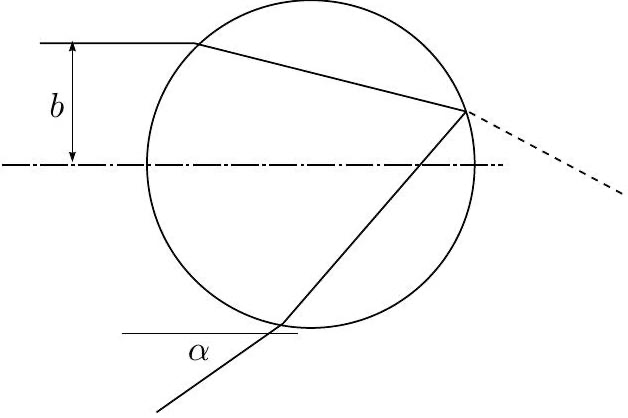

**8. OPTICS EXPERIMENT (10 points)**

**Equipment:** a cylindrical bottle filled with water and having a millimetre scale across half of its perimeter (seen when looking through the bottle); measuring tape.

**1)** Determine what length of arc of the bottle's measuring scale could be seen simultaneously when looking at it through the bottle from a very distant point (much farther away than the bottle's diameter), assuming that the observation point lies at the height of the millimetre scale.

**2)** Using the results of the previous experiment, determine the angular radius of a rainbow (the angle between a ray coming to the observer's eye from a rainbow and the axis of the cone formed by other such rays).

**Remark:** A rainbow is formed by rays which enter a spherical water droplet, reflect once from its surface internally, and exit the droplet after a second refraction. Note that the internal reflection is only partial, and not total; see figure. The exit angle $\alpha$ has a maximum as a function of the impact parameter $b$; the angular radius of the rainbow equals the maximal exit angle [indeed, if light of intensity $I_{0}$ falls onto the droplet with all possible impact parameters $b<r$, the light energy per impact-parameter range $\Delta b$ is $2 I_{0} \pi b \Delta b$; hence, the energy per exit-angle interval $\Delta \alpha$ is $\Delta I / \Delta \alpha=2 I_{0} \pi b \Delta b / \Delta \alpha=2 I_{0} \pi b(d \alpha / d b)^{-1}$, which diverges near the maximum of the function $\alpha(b)$.]

