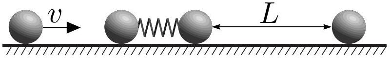

**1. DUMBBELL (6 points)**

Two perfectly elastic identical balls of mass $m$ are connected by a spring of
stiffness $k$, forming a dumbbell-like system. The dumbbell rests on a slippery
horizontal surface (all friction forces can be neglected). A third ball, identical
to the two balls in the dumbbell, approaches the dumbbell coaxially from the left
with velocity $v$ (see the figure). A fourth identical ball rests coaxially to the
right of the dumbbell.

1) Find the velocity of the centre of mass of the dumbbell after it is hit by the
ball approaching from the left.

2) For which distances $L$ between the dumbbell and the rightmost ball will the
final velocity of the latter be exactly equal to the initial velocity $v$ of the
leftmost ball?
