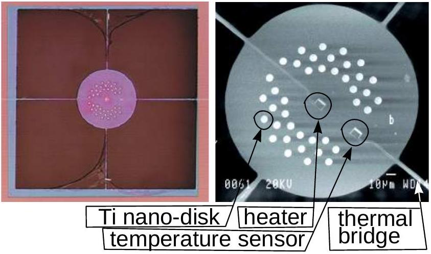

**2. MICROCALORIMETER (9 points)**

A microcalorimeter is a thin circular silicon-nitride membrane, thermally isolated
from its surroundings except that it is thermally connected to the wafer by four
thin and narrow thermal bridges (see the figure). The microcalorimeter is equipped
with a small heater in the middle of the membrane and a similar structure at the
edge of the membrane that works as a thermometer. This microcalorimeter is used to
study the thermal properties of nanoscale Ti disks (the small light dots in the
figure). The thermal power of the heater depends sinusoidally on time,
$P=P_{0} \cos (\omega t)$ (negative power implies a withdrawal of heat). The
circular frequency $\omega$ is sufficiently low that, at every moment $t$, the
temperature of the microcalorimeter $T(t)$ can be considered constant across its
entire surface, and the temperature profile along the thermal bridges can be
considered linear. The wafer to which the bridges are connected is large and thick
enough that its temperature $T_{0}$ can be considered constant at all times. Each
of the four bridges has length $L$ and cross-sectional area $S$; its thermal
conductance is $\kappa$. Thermal conductance is defined as the heat flux (measured
in watts) per unit area, assuming that the temperature drop is
$1^{\circ} \mathrm{C}$ per 1 m. The heat capacity of the microcalorimeter with the
Ti disks is $C$.

1) Find the thermal resistance $R$ between the microcalorimeter and the wafer (that
is, the ratio of the temperature difference to the heat flux).

For questions (ii) and (iii), use the quantity $R$ without substituting it using
the answer to question (i).

2) Write down the heat-balance equation for the microcalorimeter and find its
temperature as a function of time $T(t)$ [you may seek it in the form
$T=T_{0}+\Delta T \sin (\omega t+\phi)$].

3) To study the thermal properties of the Ti nanodisks, the amplitude of the
sinusoidal oscillations of $T(t)$ should change by as large a value as possible in
response to a small change in $C$ (caused by the Ti disks). Find the optimal
circular frequency $\omega_{0}$.

4) We have assumed that the temperature profile along the bridges is linear, i.e.
that their heat capacity can be neglected. For high frequencies
$\omega \gtrsim \omega_{c}$ this is not the case. Estimate the critical frequency
$\omega_{c}$ in terms of $\kappa$, $l$, the specific heat $c$, and the density
$\rho$ of the bridge material.
